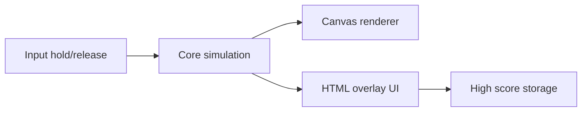

# Wormular — Foundation Plan

Handoff spec for building Wormular. Be opinionated: follow this stack and architecture unless there is a strong, documented reason not to.

## Product

Wormular is a one-tap arcade mashup of Snake and the gravity helicopter game, played in a **disk**.

- The worm always crawls **tangentially** around the center (automatic “forward”).
- **Hold** thrusts **outward**. **Release** lets gravity pull **inward**.
- Eat apples to grow. Hit rocks, the center rock, the outer wall, or yourself and the run ends.
- Title screen is the **paused starting arena** (same rocks, worm, apple as the run) with a wrapping circle-carousel mode picker (Solo / Local 1v1 / Online 1v1 always visible as center + side peeks), mode title under the logo, mode-specific chrome, and a Press & Hold prompt. Swipe or tap peeks to select; first hold/tap starts the selected mode. Solo shows high score + leaderboard (no mode tagline); Local shows the dual-control brief; Online shows nickname, with ready / queue / error copy in the same center prompt. Death returns to a fresh paused arena with the last mode still selected.

The skill loop is helicopter-style rhythm tapping to hold a radius, plus snake-style growth that makes the annulus harder to fly in.

## Tech stack (opinionated)

**Use TypeScript + HTML Canvas + Vite.** Do not use Unity, Godot, Flutter, or SpriteKit as the primary engine.

Why this stack for *this* game:

- The worm is a **stroked polyline**, food/rocks are circles, UI is overlay text. Canvas 2D is the native API for that. No sprite atlas, no scene graph, no physics engine.
- Web is a first-class target and the fastest loop for junior engineers (save, refresh, play).
- iOS (and later Android) share **100% of game code** via a thin native shell ([Capacitor](https://capacitorjs.com/) wrapping the same build).
- The simulation is ~300 lines of pure functions. That is the whole game. An engine would mostly add ceremony.

Rejected options, so juniors do not reopen this:

| Option | Why not |
| --- | --- |
| Unity | Official tvOS + WebGL, but 10x engine for a one-scene vector arcade game. Slow iOS iteration, large binaries, 2D is not the point of Unity. |
| Godot 4 | Best 2D engine, iOS/Android/web are real. **tvOS is still an unmerged engine PR**, not a junior-safe target. |
| Flutter + Flame | No official tvOS. Extra framework around a game that should be a polyline + gravity. |
| SpriteKit-first | Best native Apple feel, but web/Android become a rewrite. Iteration is the simulator, not a browser tab. |

**tvOS is the one hard platform.** WKWebView exists on tvOS and can ship a first cut of the *same* web build with Siri Remote mapped to hold/release. If that feels bad in QA (focus, performance, App Review), port only `src/core` to Swift and draw with `SKShapeNode` — the core is deliberately small enough that this is a weekend, not an architecture fork. Do not start two engines.

**Language:** TypeScript, strict. **No** React, Pixi, Phaser, or ECS. One `requestAnimationFrame` loop. Juniors should be able to read the entire runtime.

## Architecture

Keep a hard line: **simulation never knows about canvas, DOM, or Capacitor**.



- **Core** (`src/core`): polar physics, worm trail, spawn, collisions, score. Fixed timestep. Deterministic if seeded. Unit-tested with Vitest. Each `step()` returns (or appends) a small event list such as `AteFood` and `Died` so later juice can hook in without the sim knowing about particles or audio.
- **Renderer** (`src/render`): draws the current `World` to one `<canvas>`. No gameplay decisions.
- **Input** (`src/input`): pointer/touch/keyboard/tv remote → boolean `holding`.
- **UI**: real HTML overlay (title, Press & Hold prompt, high score). Do not draw the menu in canvas except the paused starting arena behind it.
- **Platform adapters**: `localStorage` on web; Capacitor Preferences on iOS/Android; UserDefaults if tvOS goes native later.

**Loop:** simulate at 60 Hz (`dt = 1/60`, clamp incoming frame time so a tab-switch does not teleport the worm). Render the latest world each animation frame.

**State machine:** `Title` | `Playing`. Game over is not a third screen — it writes high score and returns to `Title` with a fresh paused play world. The first hold unpauses that world (no spawn swap).

## Simulation spec (source of truth)

Work in **polar coordinates** around the arena center.

- Arena radius `R` (fit to `min(viewW, viewH)` minus padding).
- Center rock radius `R_core` (~0.12 `R`). Hitting it is death.
- Outer wall at `R`. Hitting it is death (helicopter ceiling).
- Head: radius `r`, angle `θ`, radial velocity `vr`.
- **Constant tangential speed**, not constant angular speed:

```
r  += vr * dt
θ  += (speed / max(r, R_core)) * dt
vr += (holding ? thrust : -gravity) * dt
vr *= exp(-drag * dt)
```

Constant *linear* speed means the worm does not become a blur at the rim. The center rock exists in part so `r` cannot hit 0 and spin infinitely.

**Feel targets** (tune in one `src/core/config.ts` file; do not scatter magic numbers):

- Mid-radius hover is possible with a ~3–4 Hz tap rhythm.
- Hold from mid-radius reaches the outer wall in ~0.45s.
- Release from near-outer reaches the center rock in ~0.55s.
- Start `speed` slow; each apple adds a little speed and body length.

**Worm body:** ring buffer of points along the path, spaced ~3px of travel. Total path length = `baseLength + apples * lengthPerApple`. Drop the tail when over budget. Collision uses a circle at the head vs. rocks/food/walls, and vs. body points **excluding a neck window** (~2 body thicknesses) so the head does not eat itself.

**Spawn:** one apple at a time in the annulus, not on the worm or rocks. Start with a few rocks plus the center rock. Rocks never spawn in the ~180° arc ahead of the worm’s heading. After eats 1–2 always add a rock (if under cap); from score 3 onward each apple has a chance, but never more than 3 points without another rock. Never spawn inside the worm’s current polyline.

**Score:** apples eaten this run. High score is max of local best; optional global leaderboard submit after death.

Starting constants (v1 baseline):

- `speed = 0.35 * R` per second (arc length)
- `thrust = 1.8 * R / s²`
- `gravity = 1.4 * R / s²`
- `drag = 2.2 / s`
- `wormThickness = 0.028 * R`
- `baseLength = 0.35 * R`

## Look: no gameplay art pipeline

**Do not generate sprite sheets or hire an artist for v1 gameplay.** Everything is procedural vector on canvas. That will look more “arcade authentic” than mediocre PNGs, and it scales perfectly to tvOS.

Palette:

- Background: `#0B1020` with a soft radial vignette
- Arena fill: `#121A33`, boundary stroke `#3A4A6A`
- Faint concentric rings (altitude guides) — important for helicopter readability
- Worm: fill `#FF7A18`, outline `#C45A10`
- Apples: red `#E23B3B` and green `#3CB86A` (alternate or random)
- Rocks: `#8B5A2B` with darker outline `#5C3B1E`

**Worm drawing (non-negotiable):** one contiguous body, not dots.

1. Darker, slightly thicker stroke of the polyline (`lineJoin` / `lineCap = round`).
2. Inner orange stroke.
3. Head disc at point 0, plus two eyes along the tangent.

Optional taper: overlapping circles along the path with radius falling toward the tail. If juniors do only the double-stroke, that is already a real worm.

Apples: circle + tiny stem + leaf (a few `arc` / `lineTo` calls). Rocks: circle with 1–2 shaded inner blobs, or a short irregular polygon from a seeded hash of rock id (still code, not files).

**Assets we *will* need later, not for gameplay:** App Icon, tvOS App Icon / Top Shelf, store screenshots. Those can be a 512 canvas export of the worm + apple, or a one-page design pass. Do not block implementation on them.

UI type: **Fredoka** (via `@fontsource/fredoka`) with system-ui fallback. Title uses optimized `assets/images/wormular.webp` (full-res `wormular-source.png` kept for edits). Keep it sparse.

## Screens and input

**Title:** full-bleed **paused** play arena so the player can find the worm and rocks before time starts. Overlay: logo (top), mode title/tagline centered between logo and arena core (Solo has no tagline), **start prompt** (center; not a click target — Solo: Press & Hold; Local: Tap to Start → 5s countdown; Online: Tap to find an opponent, then Finding / Waiting / error in that same prompt), wrapping side-circle peeks for the other two modes, and a bottom panel that swaps by mode (Solo: nickname + high score + leaderboard; Local: P0/P1 controls; Online: nickname only). Swipe horizontally or tap peeks to change mode (wraps) — selection does not start a run. Solo shows the solo start pose; Local/Online 1v1 show both worms opposite at equal radius (local reuses that layout on start). After death, a new paused world appears behind the same overlay with the mode selection preserved.

**Playing:** no HUD except a small current score. Finger/click anywhere is thrust. On death in v1: write high score if needed and return to the title overlay immediately. No freeze, shake, flash, or sound until the juice phase.

**Input map:**

- iOS/web: press/hold anywhere; `pointerdown` / `pointerup` / `pointercancel`. `preventDefault` on touch so the page does not scroll.
- Keyboard (web/dev): Space or ArrowUp hold.
- tvOS: Siri Remote **select / click** press-and-hold = thrust and also starts from title. Do not require the touch surface swipe for v1.

Respect safe area / tv overscan. The disk is letterboxed; UI sits in the overlay, not inside world coordinates.

## Repo layout (for implementers)

```
README.md
docs/PLAN.md
index.html
package.json
tsconfig.json
src/main.ts
src/core/config.ts
src/core/world.ts      // createWorld, step(world, input, dt)
src/core/worm.ts
src/core/collide.ts
src/core/spawn.ts
src/render/draw.ts
src/input/hold.ts
src/ui/title.ts
src/platform/storage.ts
src/fx/effects.ts       // eat/death VFX driven by core events
src/platform/audio.ts  // Web Audio SFX + BGM (MediaElementSource); separate mutes
tests/core/*.test.ts
```

Capacitor `ios/` is after the web game is playable, not day one. Android is a later Capacitor add. No monorepo. Device runbook: [ios.md](ios.md). ADR: [adr/0001-capacitor-ios-shell.md](adr/0001-capacitor-ios-shell.md).

## Feedback: eat and death (v1 vs juice)

**v1 has no collision juice and no sound.** Eating an apple instantly despawns it, lengthens the worm, and increments score. Hitting a rock/wall/self instantly ends the run and shows the title overlay. That is enough to ship a readable prototype and is the right call: juice is easy to overdo, and it should not delay proving the hold/gravity feel.

Core still **emits events** in v1 (`AteFood { x, y }`, `Died { x, y, cause }`) even if nothing listens. That keeps the later phase a renderer/audio add-on, not a sim rewrite.

**Juice is a subsequent phase (after title/high score, before or in parallel with iOS packaging).** It is in scope for the game, just not v1. Keep it tiny and procedural — no particle engine, no sprite sheets, no downloaded samples:

- **Eat:** apple shrinks/pops at its position (~150ms), 4–8 specks that fade, optional `+1` at the eat point. Soft high WebAudio blip.
- **Death (rock, wall, center, self):** 150ms freeze, 2–4px screenshake, worm flash or stop. Low WebAudio thud.
- One-shot effects stored in a small `FxState` array cleared as they expire. Driven by those core events, never from inside `step()`.

If it takes more than a day or starts looking like a particle editor, it is too much — cut back to pop + freeze + two beeps.

## Implementation phases (handoff order)

**v1 (mechanically complete, silent, no VFX):**

1. **Core + tests** — polar step, trail length, collide, eat/spawn, event list. Vitest. Can run headless.
2. **Canvas playable in browser** — draw arena, worm stroke, rocks, apples, hold-to-thrust. Death resets world (no UI yet).
3. **Title overlay + high score** — paused starting arena, Press & Hold prompt, persist best score.

**After v1:**

4. **Juice** — subtle eat/death VFX + two WebAudio sounds, as specified above.
5. **iOS shell** — Vite build + Capacitor, safe areas, standalone, 60fps on device. **Done for local packaging:** `capacitor.config.ts`, `ios/`, Preferences storage, edge-to-edge insets, Web Audio SFX. Simulator verified. Physical device: see [ios.md](ios.md). Decisions: [adr/0001-capacitor-ios-shell.md](adr/0001-capacitor-ios-shell.md).
6. **tvOS** — same web build in a tvOS WKWebView shell + remote hold mapping; fallback plan is Swift port of `src/core` + SpriteKit stroke.
7. **Android later** — Capacitor Android, no game changes.
8. **Store** — icons, screenshots, Game Center later (not v1).
9. **Global leaderboard** — Cloudflare Worker + D1; nickname submit on death; title-screen top N. Soft trust client scores. **Done:** Worker + remote D1; Pages builds bake `VITE_API_URL`; local mirror via `npm run dev:all`. Deploy runbook in [README.md](../README.md#production-leaderboard--online-pvp). ADR: [adr/0002-leaderboard-and-pvp.md](adr/0002-leaderboard-and-pvp.md).
10. **1v1 battle** — dual-worm sim (opposite starts, 2 apples, first death loses); local split-input; online lockstep via Durable Objects. **Done:** local + online; `MatchRoom` DO; finish-before-close; view mirror; match countdown; input pipelining.

## Quality bar (what “done” means)

- 60fps on iPhone and a desktop browser; one canvas, no per-segment sprites.
- Worm never looks like a dotted chain at any zoom.
- Hold/release latency feels immediate (input sampled every sim tick).
- High score survives refresh and app kill.
- Core tests cover: thrust increases `r`, gravity decreases `r`, eat lengthens, head-vs-rock dies, head-vs-neck does not die, head-vs-tail does.

## Explicit non-goals (v1)

Historical v1 non-goals (many now shipped): juice/SFX, particle engine, audio files, power-ups, physics engine, React, full account systems, asset pipeline, Unity. **Multiplayer and a global leaderboard are now in scope** (see phases 9–10 and ADR 0002). Still non-goals: heavy auth/OAuth, ranked ELO, authoritative physics server, Unity.
